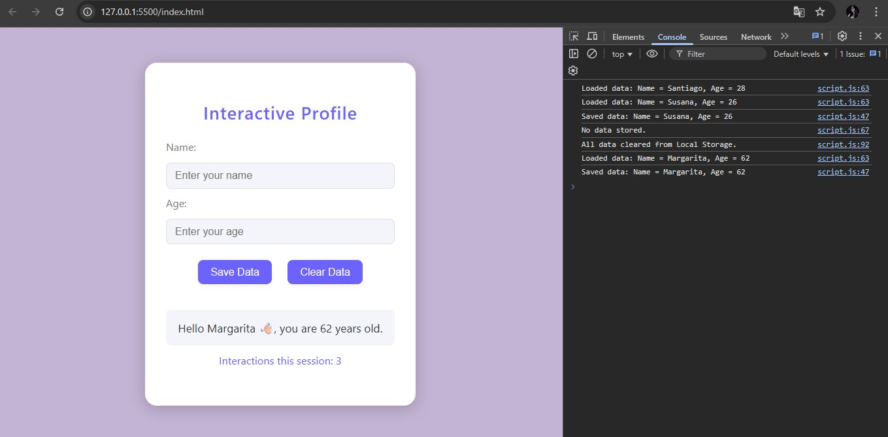
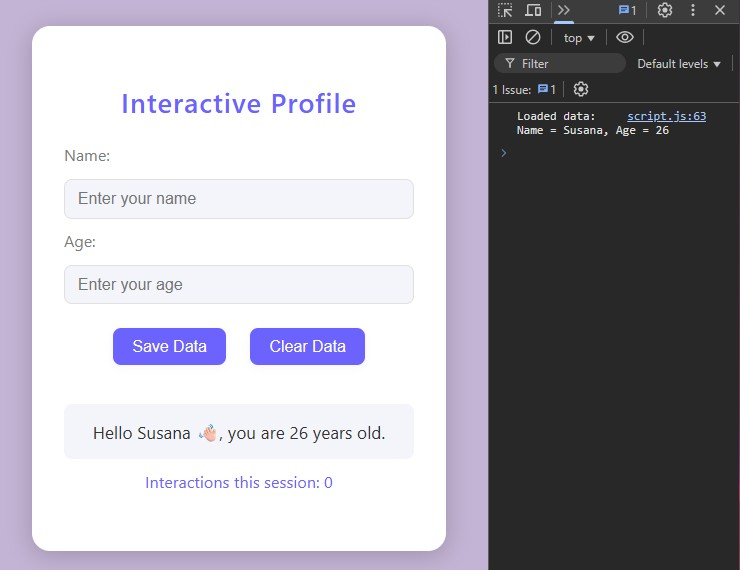
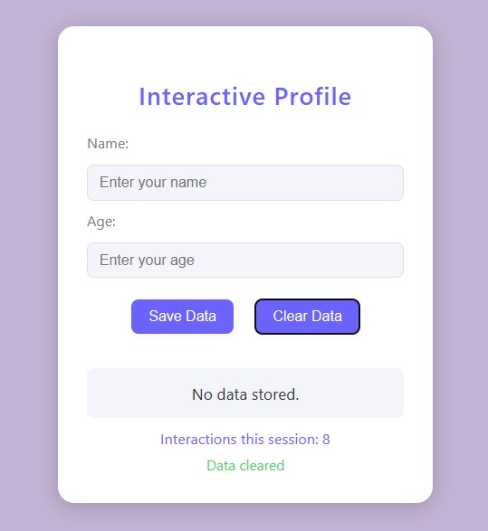

# Perfil Interactivo con Persistencia de datos

## Descripción del Proyecto
Este proyecto es un ejercicio de entrenamiento enfocado en la interacción avanzada con el DOM y la persistencia de datos en el navegador. Permite a los usuarios ingresar su nombre y edad, guardar esta información usando Local Storage y ver un contador de interacciones de la sesión usando Session Storage. La aplicación ofrece validación y retroalimentación en tiempo real, y todas las acciones se reflejan tanto en la interfaz como en la consola del navegador.

- **Modificaciones en el DOM:**
  - Ejemplo: Cuando guardas o borras datos, el mensaje mostrado en la interfaz cambia (por ejemplo, "Hola [nombre], tienes [edad] años.").
  - Cómo se implementa: La función `displayData()` actualiza el DOM y se registra un mensaje en la consola cada vez que se guardan, cargan o eliminan datos.  
- **Datos de Local Storage y Session Storage:**
  - Ejemplo: Logs en la consola mostrando cuándo se guardan datos en Local Storage (nombre y edad), cuándo se cargan y cuándo se eliminan. Además, el contador de interacciones de la sesión se actualiza y se muestra en la interfaz.  
  - Cómo se implementa: El código usa `localStorage.setItem`, `localStorage.getItem` y `localStorage.clear()` para datos persistentes, y `sessionStorage.setItem`/`getItem` para el contador de sesión. Cada acción se registra en la consola para validación. 
  

## Tecnologías Usadas
- HTML5
- CSS3 (estilo minimalista y cute)
- JavaScript (ES6+)
- APIs de Local Storage y Session Storage del navegador

## Aprendizajes Clave
- Cómo manipular el DOM dinámicamente con JavaScript
- Cómo almacenar, recuperar y limpiar datos usando Local Storage y Session Storage
- Cómo ofrecer validación y retroalimentación en tiempo real al usuario
- Cómo registrar y validar acciones usando la consola del navegador
